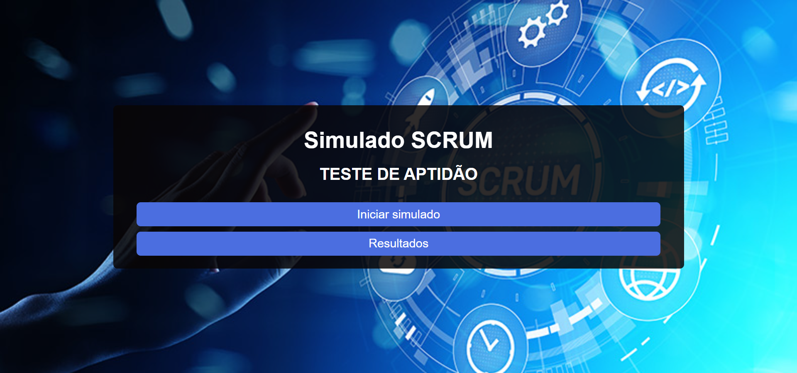
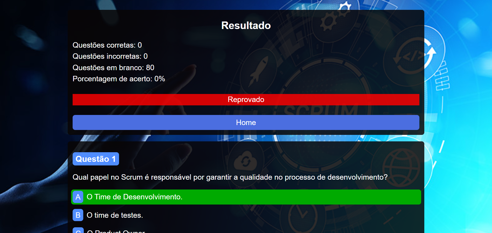
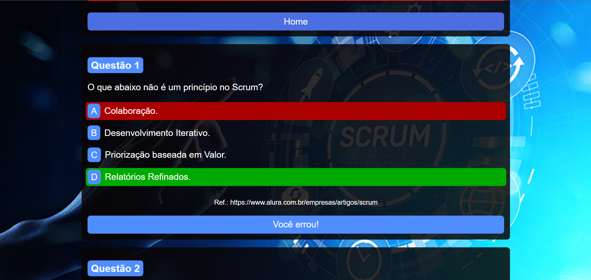
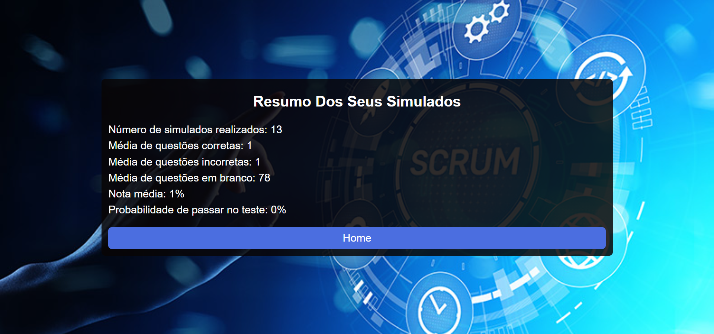

# Simulado SCRUM
Simulado de Scrum: Desenvolvido para teste de aptdão e conhecimento para uma possivel tentativa real de tirar uma cetificação SCRUM Fundamentals .O mesmo foi desenvolvido como trabalho para a universidade Uninove .

Características da aplicação:
- 80 questões por teste e mínimo de 60 para aprovação;
- O teste pode ser retomado a qualquer instante de onde o usuário parou (desde que as varíaveis de armazenamento local do navegador não sejam excluídas);
- Ao concluir o teste, o usuário será informado do número de questões que acertou, errou, deixou em branco e a porcentagem de acerto, assim como uma série de cartões demonstrando os eventuais erros e acertos nas questões.
- Opção para ver um resumo de informações estatísticas de todos os teste já realizados pelo usuário, com porcentagem demonstrando um percentual de possibilidade de passar no teste final.

A aplicação tem um design simples e responsivo, veja as imagens abaixo:

  

  

  

  

  

  

  

  

